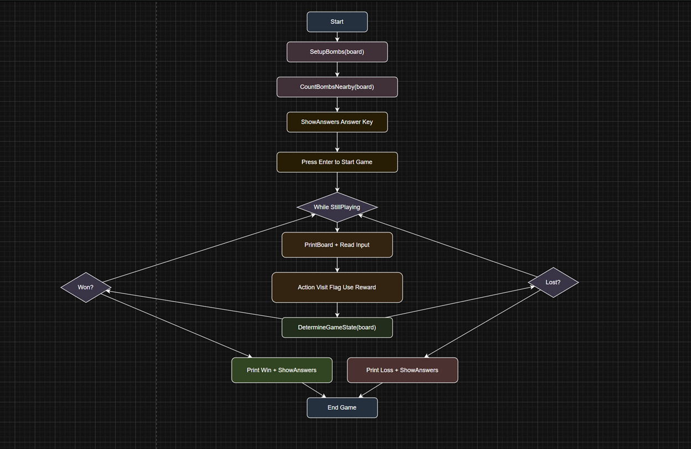
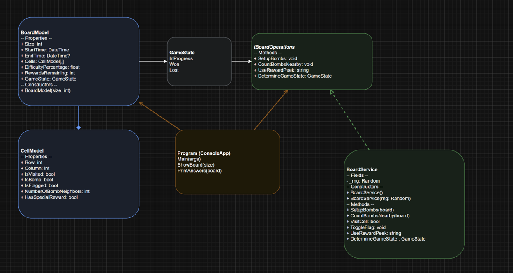
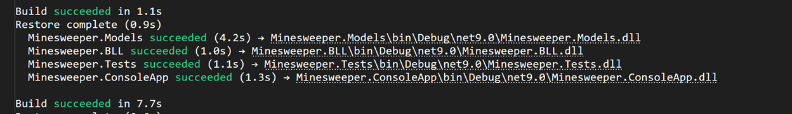
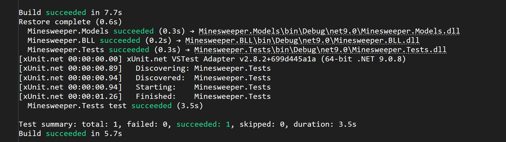
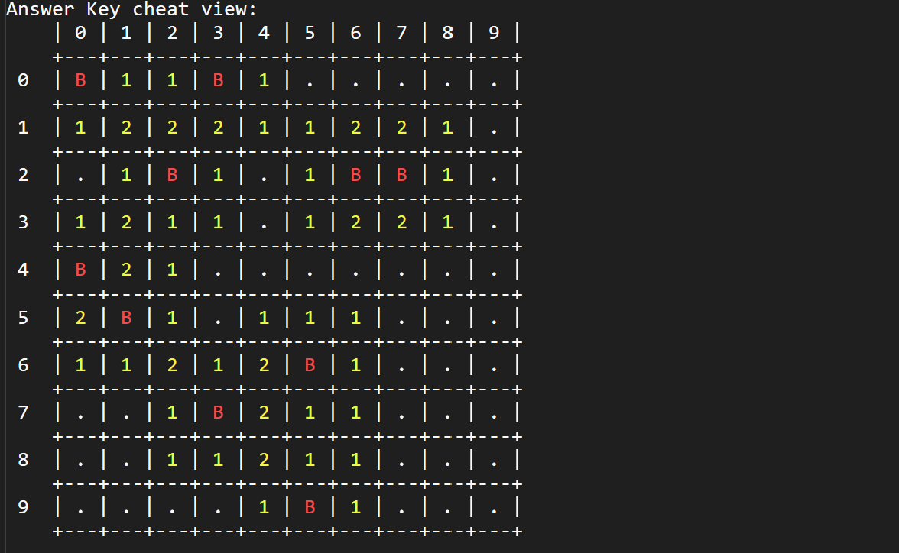
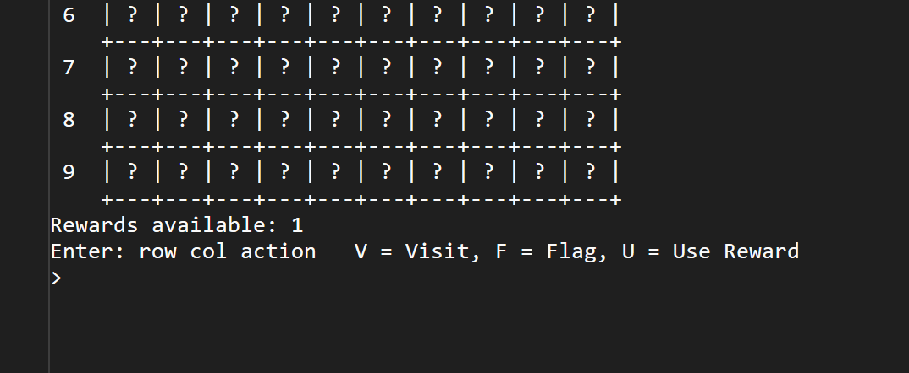
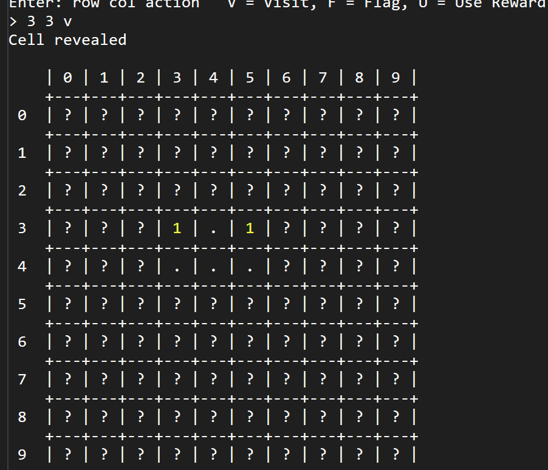
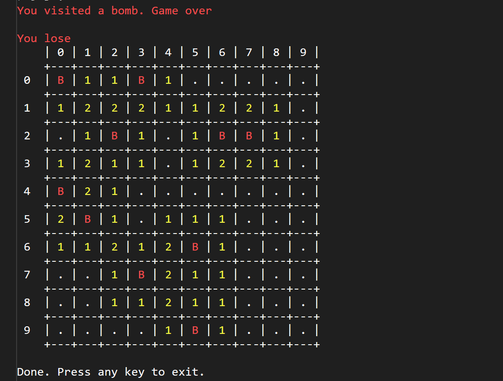
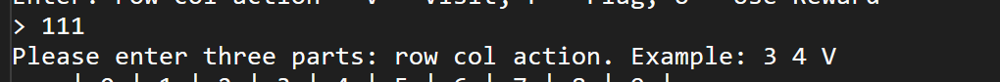
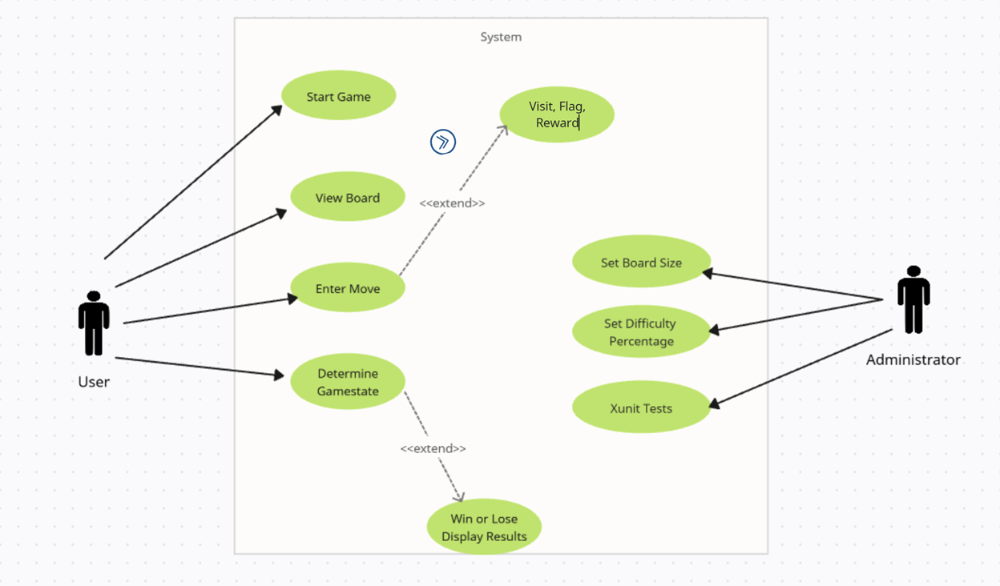

Devin Puckett

CST-250 Programming in C#2

Grand Canyon University

10/23/2025

Milestone 2

[https://github.com/devinpuckett4/CST-250-Milestone-2/blob/main/Milestone2.md]

https://www.loom.com/share/3198e704649741169c583cee6daf8717?sid=164b3c4c-f169-44fe-96ff-1ccfe53003ae

 
FLOW CHART

 
Figure 1: Flow chart of Activity 1

This flowchart shows the path my console app takes from start to finish. First, I make a small board and set the difficulty, then I place the bombs and count the numbers around each square, and I print the board with B, numbers, and dots plus labels and borders. I repeat the same steps for a larger board to prove it scales. After the boards print, I ran a couple of simple tests that check the neighbor counting and that the bomb percentage looks reasonable. Then the program ends.

UML Class Diagram

 
Figure 2: UML Class Diagram

This diagram shows how I split my project into simple parts. BoardModel and CellModel just hold the data for the game, and BoardModel owns the grid of cells. GameState is a small list that says if the game is in progress, won, or lost. The game rules live in BoardService, and it follows the IBoardOperations interface so I can call it the same way from my app. The Program class is the console app that creates a board, calls the interface to set it up, and then prints the results.

Low Fidelity

 
 
Figure 3: Screenshot of Build Success

This screenshot shows my whole solution compiling clean. Models, BLL, Tests, and the Console app all restored and built without any errors. I grabbed this first to prove the code is stable before I touch anything else. It’s basically my green light that I’m ready to run tests and play the game.

High Fidelity
 

Figure 4: High Fidelity

These are the xUnit results for the project. The tests ran and succeeded, which tells me the neighbor counting and core game logic are behaving the way I want. Seeing green here gives me confidence that the tricky parts of the rules are correct before I show any gameplay. It also gives my instructor something concrete that verifies the code, not just screenshots of the board. I like keeping this as a checkpoint so I know the logic is solid whenever I rebuild or make small changes. 

Screen Shots

 
 
Figure 5: Screenshot of Cheat Sheet

Here’s the answer key I print right before gameplay. Bombs show as B, numbers show how many bombs touch that cell, and dots are zeros. I use this to sanity-check that bomb placement and neighbor counts look right. It also makes grading easier because you can see the true board layout up front.

Figure 6: Screenshot of Legend

This is the live game board right after I press Enter to start. Everything is hidden with question marks and the prompt at the bottom tells me how to play. V is visit, F is flag, and U uses the one-time reward peek. It also shows how many rewards I still have so I don’t waste a move.

Figure 7: Screenshot of In Progress

I visited a safe cell here to show the reveal behavior. Numbers appear where the cell touches bombs and dots show empty space. That feedback is what I use to decide my next move instead of guessing. It’s a quick way to prove the reveal logic works.

 Figure 8: Screenshot of In Progress

I stepped on a bomb in this run and it ends the game. The red message pops, then the board is fully revealed so I can see exactly what I missed. That final reveal helps for debugging and also confirms the end-state logic is hooked up. It matches the milestone requirement to show a win/lose message and then the answers.
 

Figure 6: Screenshot of Error Handling

This screenshot shows my game catching a bad command. I typed 111 on purpose, and the app didn’t crash, it told me to enter three parts: row, col, action, with an example. That message comes from the checks I added in the main loop for empty input, token count, and parsing numbers. It reprompts right away, so I can try again without losing my place. This is quick proof that my input validation is working the way it should.

---
Use Case Scenario
---

This diagram lays out who does what in my Minesweeper app. The User starts the game, views the board, enters moves, and the system determines the game state; when the state changes, it extends to show the win/lose results. The Administrator side is just a maintenance role for this project, they set the board size, adjust the difficulty percentage, and run the xUnit tests to verify logic. I included an “Visit, Flag, Reward” placeholder as an extend example to show optional behavior; in my game that’s similar to optional features like the reward peek.

ADD ON

Programming Conventions	

1.	Keep files grouped by what they do: Models = data, BLL = game rules, ConsoleApp = prints and runs the game.
   
3.	Name things clearly and drop quick comments so future me knows what a method is for.
   
5.	Keep the rules out of the UI and out of the models,  the BLL is the brain, the rest is just storage or display.
   
7.	Keep methods small and to the point: SetupBombs, CountBombsNearby, VisitCell, ToggleFlag, UseRewardPeek, DetermineGameState.
   
9.	Check inputs first and show a friendly message if something’s off, then keep the game going.
________________________________________

Computer Specs

•	Windows 10/11 laptop

•	Visual Studio 2022

•	.NET SDK

•	8+ GB RAM

•	Git + GitHub account

________________________________________

Work Log  Milestone 2

Monday

•	5:45–7:15 PM Set up the solution and projects, started Git, wrote a quick README.

•	7:30–8:30 PM Made BoardModel and CellModel, plus the operations interface.

•	8:40–9:20 PM Got SetupBombs and CountBombsNearby working; first clean build.

Total: 2h 55m

Tuesday

•	5:50–7:10 PM Built PrintAnswers and PrintBoard with labels and borders.

•	7:20–8:40 PM Added the game loop and input checks.

Total: 2h 40m

Wednesday (Discussion Day)

•	6:00–6:40 PM Posted about separating models, rules, and UI; replied to a few classmates.

Total: 40m

Thursday

•	6:10–7:25 PM Added the reward square and UseRewardPeek; blocked flagging on visited cells.

•	7:35–8:20 PM Wrote DetermineGameState; fixed a small counting edge case.

Total: 2h 00m

Friday (Discussion Day)

•	6:15–6:55 PM Discussion replies on testing and input edge cases.

Total: 40m

Saturday

•	10:30–11:30 AM Cleaned comments, updated the README, retook clearer screenshots.

•	11:45–12:25 PM Updated the UML and flowchart to match the code.

Total: 1h 40m

Sunday 

•	11:00–11:35 AM Quick follow-ups and feedback on the loop and win/loss checks.

Total: 35m

________________________________________

Milestone 2 Summary

What I built

•	Random bombs by difficulty and proper neighbor counts

•	Two console views: answer key and gameplay with ?, F, numbers, and bombs

•	Actions: visit, flag/unflag, one-time reward peek

•	Input checks with helpful messages

•	Win/lose checks and a final board reveal

OOP pieces I actually used

•	Abstraction: The interface lists what the game can do

•	Encapsulation: Board and cells hold data; the service changes it

•	Separation: Models = data, BLL = rules, Console = prints and reads

Tests

•	A small xUnit test that makes sure neighbor counts are right and bombs use the sentinel value

________________________________________

Bug Report

•	Header numbers didn’t line up at first,  fixed spacing

•	Old enum value hanging around,  switched everything to StillPlaying

•	Border neighbor count off by one, fixed the bounds check

•	Extra guardrails, can’t flag visited cells; out-of-bounds moves just show a message

________________________________________

Follow-Up Questions

1) What was tough?

Lining up the console grid with the labels took a bit. Also making sure bad input didn’t break the game, things like 111 or letters, needed a few checks and messages. After 

that, the loop and state checks felt smooth.

2) What did I learn?

I learned how splitting data, rules, and UI really does make life easier. I also got a feel for how even one small unit test can help catch mistakes early.

3) How would I improve it?

I would add a flood-fill for empty spaces, a simple menu to set size and difficulty, and a few more tests for win/lose paths. Later, I would love to make a click-based GUI.

4) How does this help at work?

Keeping logic out of the UI makes things easier to test, easier to change, and easier to work on with a team. Small methods and a clear interface really help future me out.
